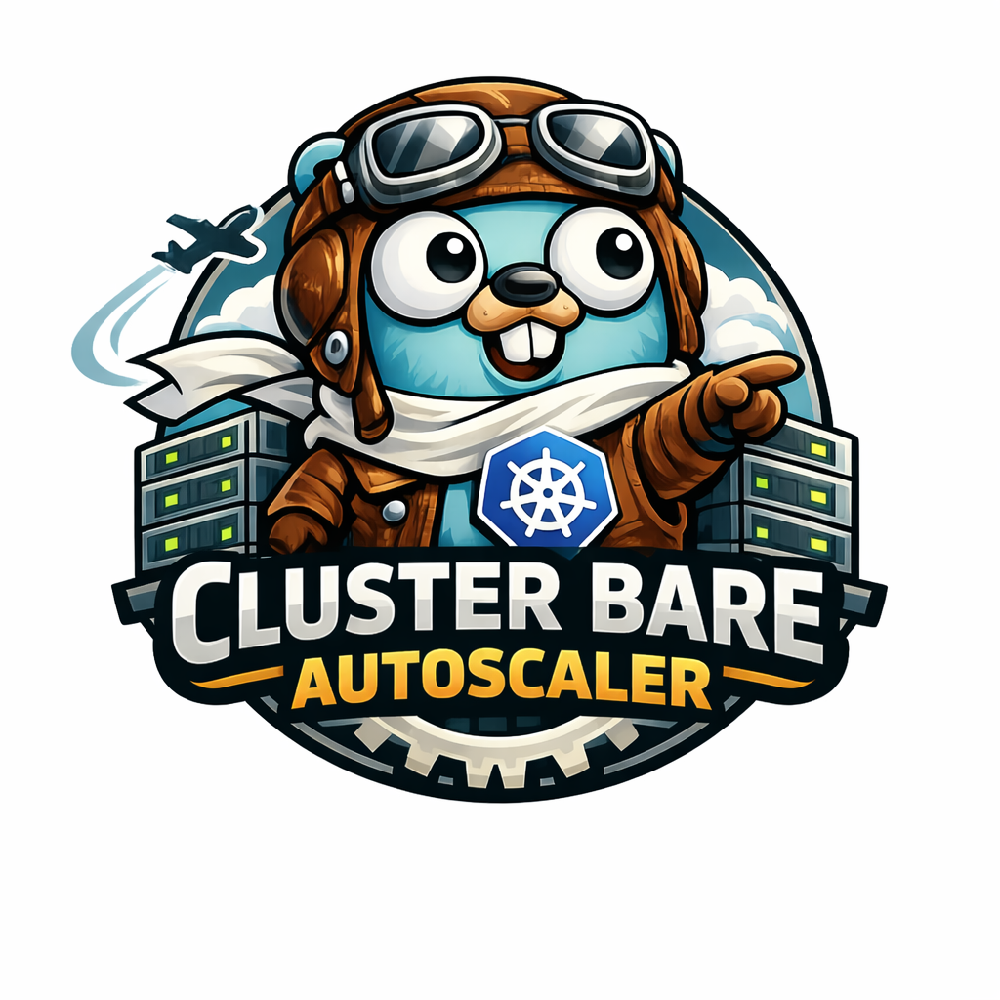

# Cluster Bare Autoscaler

**Cluster Bare Autoscaler (CBA)** automatically adjusts the size of a bare-metal Kubernetes cluster by powering nodes off or on based on real-time resource usage, while safely cordoning and draining nodes before shutdown.

This project is similar to the official Kubernetes Cluster Autoscaler, but with key differences:
- CBA does **not terminate or bootstrap instances**.
- Instead, it powers down and wakes up bare-metal nodes using mechanisms like **Wake-on-LAN**, or other pluggable power controllers.
- Nodes are **cordoned and drained safely** before shutdown.

CBA uses a **chainable strategy model** for deciding when to scale down a node. Strategies can be enabled individually or used together:
- **Resource-aware strategy** — checks CPU and memory requests and usage.
- **Load average strategy** — evaluates `/proc/loadavg` via a per-node metrics DaemonSet.

It is especially suited for **self-managed data centers**, **homelabs**, or **cloud-like bare-metal environments**.

For more details, see the [docs/README.md](docs/README.md)